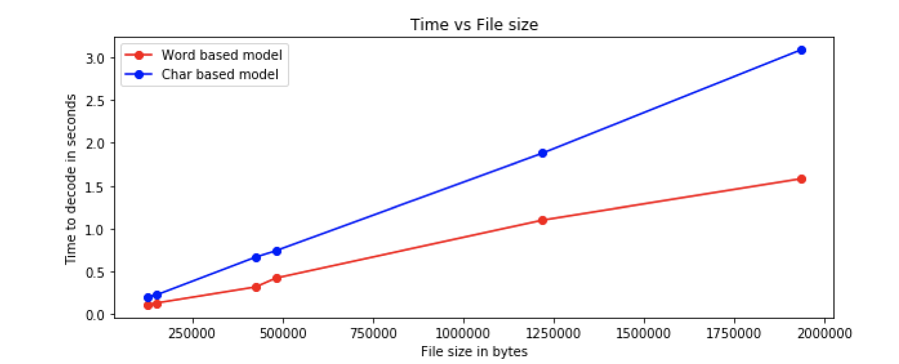

# Text-Compression-using-Huffman-coding

###### Goal: 

To compress and decompress the files using huffman coding.

###### Approach:
0. Calculate word frequency and character frequency and store the values in dictionary.
1. Build huffman code tree using heapq.
2. Store the huffman codes in .pkl file (i.e the pickle module implementing binary protocols for serializing and de-serializing a Python object structure.)
3. Compress and decompress the file using the huffman codes stored in pickle file using pickle functions pickle.dump and pickle.load respectively.
4. Use SHA256 to check the integrity of the file recovered after decompression with the original file.

###### Implementation:

def HuffmanCode(char_probability,text,filename,symbolmodel):
-	Construct nodes of the tree and store it in the object.
-	Select 2 symbols with minimum probability using heapq.heappop and merge them repeatedly until they are combined into one.
-	Build a tree of the above process: Created a HuffmanNodeObject class and used objects to maintain tree structure.
-	Assign code to characters by recursively traversing the tree.
-	Encode the input text. 
-	Pad encoded text if the length is not the multiple of 8.
-	Store the padding information in 8 bits and add this to the beginning of the encoded text.
-	Make byte array.
-	Write the byte array to binary(.bin) file.

###### Performance Evaluation:
   Here I have used “heapq” data structure to build the Huffman tree.  The advantage of using this data structure is that each time when “heappop(heap)” is used , the smallest of the heap elements is popped. Hence, we do not have to maintain sorted list as we remove elements with smallest probabilities. Moreover, when the element is pushed or popped the heap structure is always maintained with heap[0] to be the smallest element each time.
   
   To check the integrity between the input .txt file and the file recovered after decompression, SHA256 supported by hashlib library in python is used. If the hex value for the original text file is equal to the file recovered after decompression, then there is no data loss observed and the file has been correctly decompressed.
   
   Table 1 shows the evaluation parameters for word and char based symbol model w.r.t “mobydick.txt” file.

###### TABLE 1: Evaluation table

Parameters | Char based symbol model | Word based symbol model
------------ | ------------- | -------------
Time to build symbol model | 0.000637 sec | 0.26 sec
Time to encode the input file | 0.34 sec | 0.35 sec
Time to decode the compressed file | 1.88 sec | 1.10 sec
Size of symbol model | 2,042 bytes | 8,58,499 bytes
Size of .bin file after compression | 6,90,361 bytes | 3,92,563 bytes
Size of original .txt file | 12,20,150 bytes | 12,20,150 bytes 

The data compression ratio can be calculated as:
			Compression factor (CF)  = Uncompressed size/ compressed size
Consider for mobydick.txt file,
-	For char based symbol model, CF = 12,20,150/6,90,361 = 1.76

-	For word based symbol model, CF = 12,20,150/3,92,563 = 3.10

Moreover, space saving can be calculated as:
Space saving = 1 - (compressed size/ uncompressed size)
Consider for mobydick.txt file,
-	For char based symbol model, 1-(6,90,361/12,20,150) = 1-0.565800107 = 0.43

-	For word based symbol model, 1-(3,92,563/12,20,150) = 1-0.321733393 = 0.67

   From the above values we can say that, Word based symbol model performs well during compression as CF for word based symbol model is greater than character based symbol model. Moreover 67% of the size is reduced in word based model whereas only 43% of the size is reduced in character based model.
   
   On the basis of “The Canterbury Corpus”, Graph 1 shows the time required to decode with respect to different file sizes. From Graph 1 we can see that as the file size increases, time required to decode the text also increases in both character and word based symbol model. And from both the symbol models , word based symbol model performs well with respect to the time required to decode.

###### GRAPH 1: Time vs File size

Now let's compare .pkl file for two different files of same size (3.1 MB ) where, 
File 1 - contains large amounts of repetition 
File 2 - contains little or no repetition

###### TABLE 2: .pkl file size comparison
File name | .pkl file size for Char based symbol model | .pkl file size for Word based symbol model
------------ | ------------- | -------------
File 1 | 4 KB | 123 KB
File 2 | 4 KB | 1.3 MB

   From Table 2 , we can see that the File 2 (which contains little repetition) has more .pkl size as compared to the file which has large amount of repetition. Thus, as the less number of words will be repeated, the more will be the size of the symbol model and thus more will be the time to decode the text as it needs to scan big symbol model to get the corresponding huffman codeword.
   
   Similarly, the size of symbol model for character based model is same i.e 4 KB, which implies that the characters [a-z, A-Z, 0-9 and punctuations] are always repeated within the text and thus the symbol model for both the file will almost contain the codewords for same characters.
   
   Some of the drawbacks and improvements that I can think of are, 
1. Huffman codewords are data dependent and requires extra time before compression to build these codewords. But, it is not possible to use static codewords in real-time compression as the memory content and the used  set of values changes. Thus dynamic or semi-adaptive Huffman coding may be more suitable approaches. 
2. Moreover in order to carry out encoding, the encoding program need to search the value in the symbol model to find its corresponding huffman codeword. If the model is too big, it will take time to scan the model and thus slowing down the compression method. This issue may be  minimized by storing only those words in the symbol model that occur most frequently. Thus reducing the time required for compression. But this will also have its own disadvantage of degraded compression performance.

###### References:

-	Corpus.canterbury.ac.nz. (2018). The Canterbury Corpus. [online] Available at: http://corpus.canterbury.ac.nz/descriptions/ [Accessed 29 Nov. 2018].
